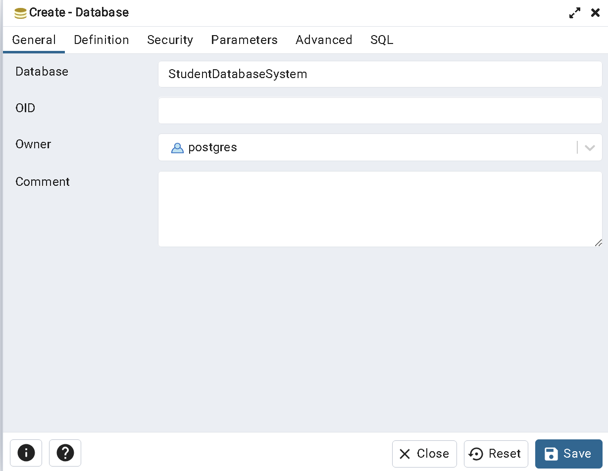

# COMP 3005 - Assignment 2 - Question 1

- Name: Nguyen-Hanh Nong
- Student Number: 101220611

## Link To Youtube Video:

https://youtu.be/Z9roVsBk4Bo

## File Structure:

```
.
├── code (folder containing the application)/
│   ├── .env (file containing the variables to connect to PostgreSQL)
│   └── database_program.py (the application written as a python file)
├── instruction_images (folder containing the images used in the README.md)/
│   └── image.png
├── setup (folder containing the files needed to be executed before the application can run)/
│   ├── ddl.sql (SQL file containing the table definitions for the application)
│   └── dml.sql (SQL file that populates students table with the initial data)
└── README.md (readme for the assignment)
```

## Instructions to Compile the Application

1. Install python and pip using the following [link](https://www.python.org/downloads/)
2. After installing python and pip, we need to run the following commands to install some python packages: \
   `pip install psycopg2`\
   `pip install python-dotenv`

## Instructions to Setup And Run the Application

1. Ensure that you have pgadmin and PostgreSQL installed on your computer.
2. Open up pgadmin and create a new database called `StudentDatabaseSystem`. \
   
3. Run the SQL code in the ddl.sql file by right clicking on **StudentDatabaseSystem** then clicking on **Query Tool**. \
   Afterwards, copy and paste the code from the ddl.sql file into the code field and click on the **Play** button to execute the code.
4. Next, run the SQL code in the dml.sql file
   by copy and pasting the code in the dml.sql file into the code field and click on the **Play** button to execute the code.
5. Before actually starting the application, we will have to modify the .env file in the code directory to fit your postgres credentials:

```
DATABASE= name of the database you just setup (default is "StudentDatabaseSystem")
HOST= the ip that your postgres server is running on (default is "localhost")
USER= name of your psql account
PASSWORD= password of your psql account
PORT= number of port you want to run postgres on (default is "5432")
```

6. To actually start the application, navigate to the \code folder and run the following command in a terminal to start the program: \
   `python database_program.py`
